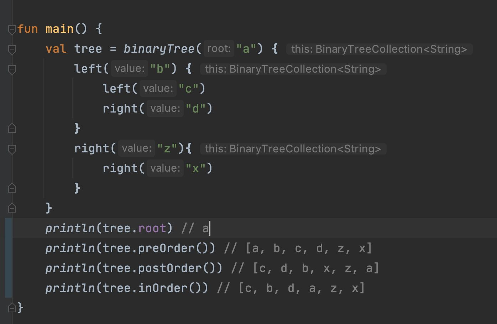

# TODO
1. UPDATE Node
2. DELETE Node


# DSL Preview



# Notes on Trees

# Tress Data Structure
- Tree is Collection of `nodes` + `edge`
    - one of node is `root node`
    - rest of nodes are `dis-joint subset`
        - each subset is tree again
- if `n` nodes then `n-1` edges 
        - cause `root node` have `2` edges not `3` 
    - each subset is a tree or sub-tree   
    
## Terminology of Trees    
- Root - topmost node of tree
- Parent - node is parent to the descendants nodes
- Child - node which have a parent
- Siblings - parent of same parent
- Descendants - all the nodes than can be reached `under` a node in tree
- Ancestors - all the nodes `up` from `that node` to `root node` is ancestors
- Degree of node - `number of direct children` a node has [❌ descendants]
- Internal/External nodes `|` non-leaf/leaf `|` terminal/non-terminal nodes 
    - node with `degree 0` are external/leaf/terminal node
    - node with `degree > 0` are internal/non-leaf/non-terminal node
- levels - horizontal nodes/floor of nodes [starts with 1] - count path to reach a node
- height - floor of node [starts with 0] - number of edges
- forest - collection of trees


```
                                                    | Levels    |   Height
                              (A)  <- root node     |   1       |     0
                              / \                   |           |
             child node ->  (B) (C)  <- child node  |   2       |     1
                            / \                     |           |
            child node -> (D) (F) <- child node     |   3       |     2
                                                    |           |
|----------------------------------------------------------------------------------|
|   [Root]
|     A
|----------------------------------------------------------------------------------|
|   [Parent]
|   A - Parent -> B, C 
|   B - Parent -> D, F 
|----------------------------------------------------------------------------------|
|   [Child]             |        [Siblings]         |      [Descendants]
|   B - Child -> A      |       B,C -> Siblings     |   A - descendants -> B,C,D,F 
|   C - Child -> A      |       D,F -> Siblings     |   B - descendants -> D,F
|   D - Child -> B      |                           |   
|   F - Child -> B      |                           |
|----------------------------------------------------------------------------------|
|   [Ancestors]             |       [Degree]        |   [internal/external-nodes]
|   D - ancestors -> B,A    |   A - degree -> 2     |     A - internal/non-leaf
|   F - ancestors -> B,A    |   B - degree -> 2     |     B - internal/non-leaf
|   B - ancestors -> A      |   C - degree -> 0     |     C - external/leaf
|   C - ancestors -> A      |   D - degree -> 0     |     D - external/leaf
|                           |   F - degree -> 0     |     F - external/leaf
|----------------------------------------------------------------------------------|

```

## Binary Tree
A tree of degree `2` - i.e. max it can have 2 children node, can `have less than 2` but more than 2.
```
    degree(T) = 2                       (A)
    children = {0,1,2}                  / \     [Binary tree]
                                      (B) (C)
```

## Un-Labelled Nodes (Combinations)
### Number of binary trees : Catalan number
```
            2n              
 T(n) =       C           or  T(n) = SumAll(i,n)-> T(i-1) * T(n-i)
                n               
            ------
              n+1
```
Example : T(3) = __2x3 C 3 / 3+1 = 6 C 3 / 4 = (6x5x4 / 3x 2x 1)/ 4 = 5x4/4 = 5__
<br>
Example : T(3) = __T(0)xT(2) + T(1)xT(1) + T(2)xT(0) = 1x2 + 1x1 + 2x1 = 2+1+2 = 5__


### Total number of trees with max height in binary trees
```
    T(MaxHeight(n)) = 2^(n-1)
``` 
Example : T(4) = __2^3 = 8__

## Labelled Nodes (Arrangements)
### Number of binary trees : Catalan number
```
             shape      permutations
          |---------| |--|              
 T(n) =    [ 2n^Cn ] * n!                 
            -------
              n+1
```

## Relation between `Heights` and `Nodes` in Binary Tree
```
min(n) = height + 1            max(h) = nodes - 1
max(n) = 2^(h+1) - 1           min(h) = log2(n+1) - 1 

degree(0) = degree(2) + 1
```

## Strictly m-ary tress
```
min(n) = (m*height) + 1                 max(h) = (nodes - 1)/m
max(n) = (m^(h+1) - 1) / m-1            min(h) = logm[nodes(m-1)+1] - 1 

```

#Trees
can be represented using `List` or `LinkedList`

```                            
                         (A)       
                     /         \                   
                  (B)          (C)    
                  / \          / \                     
                (D) (E)      (F) (G)   
```

#### List relationship
```
    [A] [B] [C] [D] [E] [F] [G] 
     0   1   2   3   4   5   6
    
    ------------------------------------------------------
    |   element    |  index   | left child | right child |
    ------------------------------------------------------
    |      A       |    0     |     1      |      2      |
    ------------------------------------------------------
    |      B       |    1     |     3      |      4      |
    ------------------------------------------------------
    |      C       |    2     |     5      |      6      |
    ------------------------------------------------------
    |      D       |    3     |     -      |      -      |
    ------------------------------------------------------
    |      E       |    4     |     -      |      -      |
    ------------------------------------------------------
    |      F       |    5     |     -      |      -      |
    ------------------------------------------------------
    |      G       |    6     |     -      |      -      |
    ------------------------------------------------------
    |    formula   |    i     |   (2xi)+1  |   (2xi)+2   |
    ------------------------------------------------------
    
    parent = floor(i / 2)
```

#### Linked relationship
```
                    Node
    -----------------------------------------
    | [left child] | [data] | [right child] |
    -----------------------------------------
    doubly linked

                    [][A][]
                   /        \
            [][B][]          [][C][]
            /                       \
        [X][D][X]                 [X][E][X]
```


